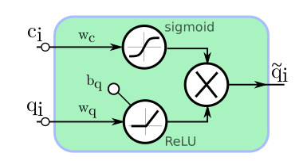
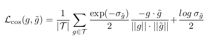
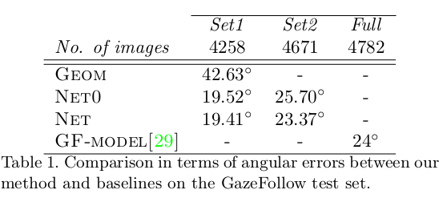
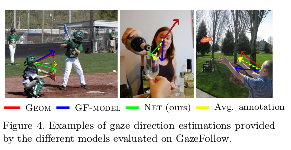

# Gaze-Estimation
### a) Papers

### 1. Gaze Estimation for Assisted Living Environments(WACV-2020)
    
   - Paper Repository: https://bitbucket.org/phil_dias/gaze-estimation/src/master/
   - Paper Link: http://openaccess.thecvf.com/content_WACV_2020/papers/Dias_Gaze_Estimation_for_Assisted_Living_Environments_WACV_2020_paper.pdf
    
   - Contributions
    
       Authors summarize their contributuions to gaze estimation problem with three main points:
    
       * They propose an approach that relies solely on the relative positions of  facial keypoints
         to estimate gaze direction. 

       * Estimation uncertainity is also given with gaze direction prediction.
         (???Bayesian neural networks and aleatoric uncertainty)

       * Confidence gated units is introduced to disregard faceial keypoint detections for which 
         a low confidence level is provided.

   * Proposed Approach
        
        OpenPose is used to detect anatomical keypoints of all the persons present in the scene. Only 
        keypoints located in the head (the nose, eyse and ears) is considered for each indiviudal.
        The keypoints is used to find head centeroid by computing mean coordinate for all head keypoint.
        Then, head keypoints are normalized according to farthest distance to head centeroid. Normalized 
        15 keypoints are concaneted to form a feature vector. These 15 points are s.t. 2 left eye coordinate,
        2 right eye coordinate, 2 left ear coordinate, 2 right ear coordinate, 2 nose coordinate and 5 confidence
        score for eyes,ears and nose. On the other hand, log(uncertanity) helps avoiding an exploding uncertanity
        prediction.
        
        In occlusion cases, OpenPose results with 0 coordinates for x and y axes and confidence score. Since head
        head centroid is located at (0,0), confidence score 0 has a crucial role in indicating absence of keypoint.
        
        Authors introduced a Confidence Gated Unit to fuse confidence score with coordinates at the input of neural 
        network. Unit can be observed below:
        
        
        
        Here, ci is the confidence score and qi is the x or y coordinates. For 5 coordinates of eyes,ears and nose
        10 CGU are used at input. Each (x,c) and (y,c) pair is fed to these 10 units. These results a feature vector 
        with dimension of (10,1). Then, 3 FC layer is used. These FC layers have 10,10 and 3 units. Final FC layer
        provides gaze direction g=[g_x , g_y] and a confidence score for gaze estimation.
        
        During network training, cosine uncertanity loss function is used. The loss function can be observed below:
        
        
        
        Here, g is the ground truth, g_tilda is predicted result and sigma_g_tilda is network uncertanity.
        As angular error between ground truth and prediction increases, loss increases and during optimization
        uncertanity increases to decrease loss value. In this way, a higher network results with higher uncertanity
        when angular error is large.
        
   * Paper Results
        Results over GazeFollow dataset can be seen below:
        
        
        
        
        Here, Geom model is a gemotric based method which applies hand-crafted techniques. GF-Model is 
        the architecture described with paper of GazeFollow dataset. NET is the architecture defined here and
        NET0 is a different version of NET which does not use prediction uncertanity provided by OpenPose. Results
        over GazeFollow set2 shows that using uncertanity values increases accuracy by amount of 2.33 degree.
       

### b) Datasets
GazeFollow

