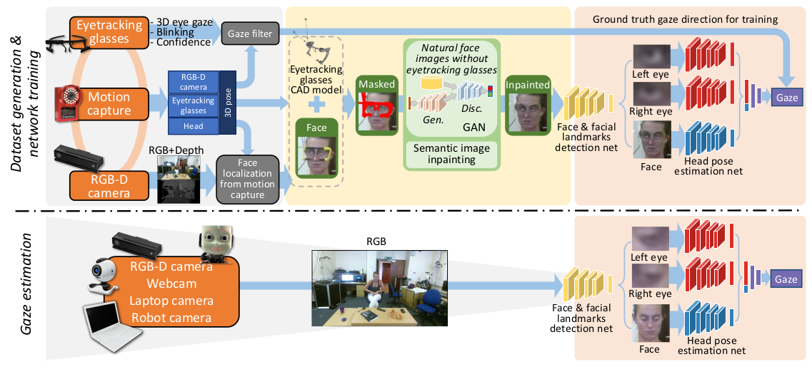
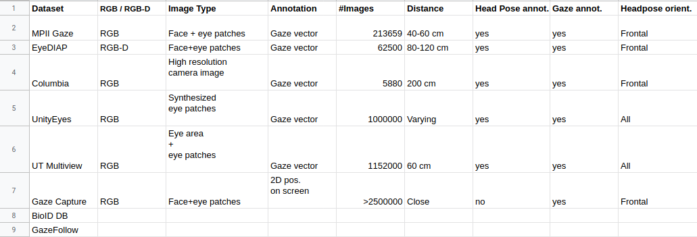

# Gaze-Estimation
### a) Papers

### 1. Gaze Estimation for Assisted Living Environments(WACV-2020)
    
   - Paper Repository: https://bitbucket.org/phil_dias/gaze-estimation/src/master/
   - Paper Link: http://openaccess.thecvf.com/content_WACV_2020/papers/Dias_Gaze_Estimation_for_Assisted_Living_Environments_WACV_2020_paper.pdf
    
   - Contributions
    
       Authors summarize their contributuions to gaze estimation problem with three main points:
    
       * They propose an approach that relies solely on the relative positions of  facial keypoints
         to estimate gaze direction. 

       * Estimation uncertainity is also given with gaze direction prediction.
         (???Bayesian neural networks and aleatoric uncertainty)

       * Confidence gated units is introduced to disregard faceial keypoint detections for which 
         a low confidence level is provided.

   * Proposed Approach
        
        OpenPose is used to detect anatomical keypoints of all the persons present in the scene. Only 
        keypoints located in the head (the nose, eyse and ears) is considered for each indiviudal.
        The keypoints is used to find head centeroid by computing mean coordinate for all head keypoint.
        Then, head keypoints are normalized according to farthest distance to head centeroid. Normalized 
        15 keypoints are concaneted to form a feature vector. These 15 points are s.t. 2 left eye coordinate,
        2 right eye coordinate, 2 left ear coordinate, 2 right ear coordinate, 2 nose coordinate and 5 confidence
        score for eyes,ears and nose. On the other hand, log(uncertanity) helps avoiding an exploding uncertanity
        prediction.
        
        In occlusion cases, OpenPose results with 0 coordinates for x and y axes and confidence score. Since head
        head centroid is located at (0,0), confidence score 0 has a crucial role in indicating absence of keypoint.
        
        Authors introduced a Confidence Gated Unit to fuse confidence score with coordinates at the input of neural 
        network. Unit can be observed below:
        
        
        
        Here, ci is the confidence score and qi is the x or y coordinates. For 5 coordinates of eyes,ears and nose
        10 CGU are used at input. Each (x,c) and (y,c) pair is fed to these 10 units. These results a feature vector 
        with dimension of (10,1). Then, 3 FC layer is used. These FC layers have 10,10 and 3 units. Final FC layer
        provides gaze direction g=[g_x , g_y] and a confidence score for gaze estimation.
        
        During network training, cosine uncertanity loss function is used. The loss function can be observed below:
        
        
        
        Here, g is the ground truth, g_tilda is predicted result and sigma_g_tilda is network uncertanity.
        As angular error between ground truth and prediction increases, loss increases and during optimization
        uncertanity increases to decrease loss value. In this way, a higher network results with higher uncertanity
        when angular error is large.
        
   * Paper Results
        Results over GazeFollow dataset can be seen below:
        
        
        
        
        Here, Geom model is a gemotric based method which applies hand-crafted techniques. GF-Model is 
        the architecture described with paper of GazeFollow dataset. NET is the architecture defined here and
        NET0 is a different version of NET which does not use prediction uncertanity provided by OpenPose. Results
        over GazeFollow set2 shows that using uncertanity values increases accuracy by amount of 2.33 degree.
        
### 2. RT-GENE: Real-Time Eye Gaze Estimation in Natural Environments (ECCV-2018)
    
   - Paper Repository: https://github.com/Tobias-Fischer/rt_gene
   - Paper Link: http://openaccess.thecvf.com/content_ECCV_2018/papers/Tobias_Fischer_RT-GENE_Real-Time_Eye_ECCV_2018_paper.pd
   
   - Contributions
   
       Authors contributions are s.t.:
       
       * A method for gaze dataset generation with eye-tracking glasses
       * A neural network for gaze estimation which reach to state-of-the-art results

   * Proposed Approach
   
       Paper tries to generate a gaze estimation dataset. The proposed method for dataset generation 
       utilized an eye-tracking glasses. During dataset generation, person wear an eye-tracking glasses
       and glasses provides gaze annotations. Then, eye-glasses region is removed from image and removed region is 
       filled by semantic image inpainting. Paper claims that inpaining improves gaze estimation accuracy. 
       The block diagram of proposed method can be seen below:
       
       
       
       Deep learning based methods have different approcahes for gaze estimation. In these approaches, inputs
       of the network can change. 
       - Eye patches can be directly feed to a CNN for gaze estimation
       - Eye patches and head pose information can be used for gaze estimation
       - Eye patches, face image can be used for gaze estimation
       
       Paper used MTCNN network to detect face along with landmarks point of the eyes,nose and mouth corners. 
       By using extracted landmarks, face patch is rotated and scaled to minimize distance between the aligned 
       landmarks and predefined average face point positions. This provides a normalized face image.(accelerated 
       iterative closest point algorithm is used for normalization). Then, by using eye corners, eye patches are 
       extracted from normalized face image(fixed sized rectangles centered around landmarks). Also, head pose is 
       estimated by adopting the methods used in [Head pose estimation in the wild using convolutional neural 
       networks and adaptive gradient methods].
       
       After extraction of eye patches, each eye image is fed to VGG-16 network for feature extraction. 
       A FC layer of size 512 is used after last max pooling layer of VGG-16 and FC is followed by batch normalization 
       and ReLU layer. FC layers coming from eye patches are combined and it has size of 1024. This final layer is 
       followed another FC with size of 512. This final FC layer size of 512 is combined with head pose information and 
       it is followed two more FC layer with size of 512 and 2 . Final 2 output gives yaw and pitch angle of gaze 
       direction.

   
   
### b) Datasets

